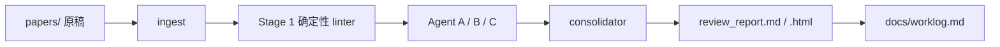

# thesis-review-pipeline

[](https://www.python.org/downloads/)
[](LICENSE)
[](#硬约束)
[](#硬约束)

中文本科毕业设计初稿的审稿流水线。机械预检之后，按 A / B / C 分审，再聚合成四段式报告。对象是工科、理科中达到校级优秀或具备发表潜力的初稿。

本仓库按编码 Agent 工作区来组织。约定写在 [`AGENTS.md`](AGENTS.md) 与技能 [`thesis-review`](.agents/skills/thesis-review/SKILL.md)。ZCode、Codex 与 WorkBuddy 等同类工具读完约定即可执行；CLI 可单独跑 ingest、预检和渲染，不绑定某一家 Agent 产品。

仓库执行审稿，不改写 `papers/` 中的源文件。默认离线，不把稿件发到第三方文献 API。

## 目录

- [适用范围](#适用范围)
- [流水线](#流水线)
- [给 Agent 的入口](#给-agent-的入口)
- [环境](#环境)
- [命令](#命令)
- [一次 run 的产物](#一次-run-的产物)
- [报告合同](#报告合同)
- [硬约束](#硬约束)
- [测试](#测试)
- [隐私](#隐私)
- [外部参考](#外部参考)
- [许可](#许可)

## 适用范围

| 做 | 不做 |
| --- | --- |
| 中文工科 / 理科本科毕业设计初稿评审 | 直接改写论文正文 |
| `.md` `.docx` `.pdf` `.tex` `.typ` 归一后预检 | 虚构 DOI、基线成绩、审稿人原话 |
| 四段式报告与五维评分卡，以及问题–证据表和二稿路线图 | 未授权的文献外搜（`--online`） |
| 把真实稿件留在本地 `papers/`，不入库 | 把学位论文改写成 SCI 投稿稿 |

中文 LaTeX 的格式与国标检查可叠加技能 `latex-thesis-zh`。英文 SCI / 顶会深审叠加 `paper-audit`（仅 `.tex` / `.typ` / `.pdf`）。DOCX 转 Markdown 用 `docx-to-markdown`。

## 流水线

```text
ingest → Stage 1 linter → Agent A / B / C → consolidator → 四段式报告 → worklog
```



1. **Stage 1** 确定性 linter。检查未定义符号与过强断言，以及结构缺口。缺口覆盖综述和问题形式化，也包括消融、基线、方差和失效案例。否定句「未做消融」不得判成已经完成该项工作。
2. **Stage 2** 分审提示词：A 动机与文献边界，B 方法严密性，C 实验充分度。填写 `runs/<id>/agents/*.json`。
3. **Stage 3** 聚合为四段式报告：总体评价、Major、Minor、二稿路线图；附五维评分卡与问题–证据表。

`init-run` 完成 ingest 与 Stage 1，并写出带预检证据的初稿报告。深审须填完 JSON 后再 `render`。定级只能是 **优秀 / 良好 / 及格 / 退修**；机械预检单独不得给优秀。

样例 run（虚构稿，定级退修）：[`runs/20260917-112554-sample_thesis/review_report.md`](runs/20260917-112554-sample_thesis/review_report.md)

## 给 Agent 的入口

把本仓库当作工作区打开后，按下列顺序执行。细则以 [`AGENTS.md`](AGENTS.md) 与 [`thesis-review`](.agents/skills/thesis-review/SKILL.md) 为准。

1. 读 `AGENTS.md`。用户提出审稿或优秀毕设评阅时，先执行 `thesis-review`，不要改论文源文件。
2. 确认稿件路径；复制或指向 `papers/`。未获明确授权不要外搜文献。
3. 用项目内 CPython 3.12 运行 `init-run`，阅读 `runs/<id>/stage1/linter.md`。
4. 按 `templates/agents/` 填写：
   - A → `agents/agent_a_motivation.json`（绪论与相关工作）
   - B → `agents/agent_b_methodology.json`（方法 / 模型 / 系统）
   - C → `agents/agent_c_experiments.json`（实验与分析）
   - 聚合 → `agents/consolidator.json`
5. 运行 `render`。核对报告含且仅含合同规定的四级标题。
6. CLI 会向 `docs/worklog.md` 追加一条；深审结束后再补一条人工摘要。日志与 `metadata.json` 只写相对路径。

Major 每条必须含：章节或公式、图表定位；原文摘引；问题；理论或学术依据；可执行的改法。找不到证据就不要写。同一根因只保留一条 Major，附全部定位。

## 环境

Python **3.12** 虚拟环境（仓库根目录 `.venv`）。不要往系统 Python（含 3.14）里装依赖。

```bash
uv venv .venv --python 3.12
uv pip install -r requirements.txt --python .venv/Scripts/python.exe
source .venv/Scripts/activate          # Git Bash
# .venv\Scripts\activate               # cmd / PowerShell
# source .venv/bin/activate            # macOS / Linux
```

未激活时用解释器绝对路径。Windows：

```bash
.venv/Scripts/python.exe scripts/thesis_review.py init-run papers/sample_thesis.md --title "题目" --field "计算机科学与技术"
```

Unix：

```bash
.venv/bin/python scripts/thesis_review.py init-run papers/sample_thesis.md --title "题目" --field "计算机科学与技术"
```

锁定文件：[`requirements.txt`](requirements.txt)。PDF 用 `pymupdf` / `pymupdf4llm`，DOCX 用 `mammoth` 与 `markdownify`，报告用 `Jinja2`，测试用 `pytest`。

## 命令

把待审稿放进 `papers/`（该目录除样例外默认不入库）：

```bash
.venv/Scripts/python.exe scripts/thesis_review.py init-run papers/你的论文.md --title "题目" --field "专业"
.venv/Scripts/python.exe scripts/thesis_review.py render runs/<id>
```

| 子命令 | 作用 |
| --- | --- |
| `ingest <file>` | 把 `.md` `.txt` `.tex` `.typ` `.pdf` `.docx` 归一为 UTF-8 Markdown，写入 `ingest/` |
| `lint <file>` | Stage 1 机械预检；`--json` 输出结构化结果 |
| `init-run <file>` | ingest + lint + 分审骨架 + 初稿报告 |
| `render <run_dir>` | 根据 `agents/*.json` 重渲染四段式报告 |
| `audit <file>` | 可选封装 `paper-audit`，仅 `.tex` / `.typ` / `.pdf` |

`.tex` / `.typ` / `.pdf` 需要 `paper-audit` 机械层时：

```bash
.venv/Scripts/python.exe scripts/thesis_review.py audit papers/xxx.pdf --mode quick-audit --lang zh
```

未安装 `paper-audit` 时该子命令以退出码 2 失败，主路径 `init-run` 不受影响。

## 一次 run 的产物

`init-run` 在 `runs/<YYYYMMDD-HHMMSS>-<slug>/` 下生成：

| 路径 | 含义 |
| --- | --- |
| `paper.md` | 归一后的审稿用文本 |
| `metadata.json` | 题目与专业、源路径（相对）、阶段与定级 |
| `stage1/linter.md` | 未定义符号与过强断言，以及结构缺口（可读） |
| `stage1/linter.json` | 同上，供 Agent 与 render 读取 |
| `agents/*.md` | A / B / C / consolidator 阅读说明（自 `templates/agents/` 复制） |
| `agents/*.json` | 分审填写处；`status` 初值为 `pending` |
| `review_report.md` | 四段式报告 |
| `review_report.html` | 同内容 HTML |
| `worklog.md` | 本 run 的本地记录 |

仓库目录（公开跟踪的部分）：

```text
.
├── AGENTS.md                 # Agent 硬约束与入口
├── papers/sample_thesis.md   # 虚构样例；其余 papers/* 不入库
├── scripts/thesis_review.py  # CLI
├── templates/agents/         # 分审合同
├── ingest/                   # 归一文本（样例外不入库）
├── runs/                     # 审稿产物（样例外不入库）
├── docs/references.md        # 外部项目取舍
└── docs/worklog.md           # 工作日志
```

## 报告合同

下列标题必须原样出现，不得改写或增删层级：

- `### 一、 总体评价与学术定位（Executive Summary）`
- `### 二、 实质性修改意见（Major Comments - 关乎学术严谨性与论证逻辑）`
- `### 三、 规范性与细节性修改意见（Minor Comments - 关乎格式、符号与表达）`
- `### 四、 二稿修改路线图与落地行动计划（Actionable Revision Roadmap）`

五维评分卡（1–5）：问题定义、文献综述、方法严密性、实验充分度、写作规范。`init-run` 按预检自动打分，深审可在 `consolidator.json` 覆盖。

结构缺口中，`problem_formulation` / `related_work` / `ablation` / `baseline` 默认 Major；未定义符号默认 Minor，若出现在损失函数或定理陈述中则升 Major；过强断言且缺数字、缺引用为 Major。

## 硬约束

| 规则 | 说明 |
| --- | --- |
| 只审不改 | 不得直接改写 `papers/` 中的论文源文件 |
| 证据锚定 | 每条 Major 必须带定位与原文摘引 |
| 不编造文献 | 不得虚构 DOI、基线成绩或审稿人原话 |
| 默认离线 | 未获用户明确授权不得 `--online` / 文献外搜 |
| 工作日志 | 每次 CLI 或实质性审稿步骤必须追加 `docs/worklog.md` |
| 隐私 | 真实学生论文、学号、姓名、学校内部材料不得提交 git |

## 测试

```bash
.venv/Scripts/python.exe -m pytest tests -q
```

覆盖 ingest 与 linter，也覆盖 scorecard、render 和 `init-run` CLI。提交前应保持通过。

## 隐私

公开仓库**只**跟踪虚构样例 `papers/sample_thesis.md` 和对应样例 run。真实毕业设计、学号与姓名、学校内部材料不要 `git add`。后续审稿 run 被 `runs/*` 忽略。日志与 `metadata.json` 只写相对路径，不写本机绝对路径。

## 外部参考

本仓库不 fork 下表项目。它们做顶会仿真或专用审稿模型，有的则是提示词箱，都没有中文本科毕设的四段合同。这里吸收的是可落地的机制。完整取舍见 [`docs/references.md`](docs/references.md)。

| 项目 | 吸收了什么 |
| --- | --- |
| [AliManjotho/open-reviewer](https://github.com/AliManjotho/open-reviewer) | 评分卡、问题–证据表、Markdown + HTML 双输出 |
| [FanBroWell/AI-paper-reviewer](https://github.com/FanBroWell/AI-paper-reviewer) | 过强 claim / 红旗分级，映射为 linter 的 OC\* 与 Major / Minor |
| [Ahren09/AgentReview](https://github.com/Ahren09/AgentReview) | 分角色再聚合的流程形状（对应 A / B / C + consolidator） |
| [allenai/marg-reviewer](https://github.com/allenai/marg-reviewer) | 按章节专精的 Agent，替代单篇超长提示词 |
| [maxidl/openreviewer](https://github.com/maxidl/openreviewer) | PDF→Markdown 作为审稿输入的必要性 |

论文：[MARG (arXiv:2401.04259)](https://arxiv.org/abs/2401.04259)、[AgentReview (arXiv:2406.12708)](https://arxiv.org/abs/2406.12708)、[OpenReviewer (arXiv:2412.11948)](https://arxiv.org/abs/2412.11948)。

未采用：把学位论文改写成 Q1 论文的仓库（与「只审不改」相反）；同名代码评审 Agent。

## 许可

[MIT](LICENSE)
